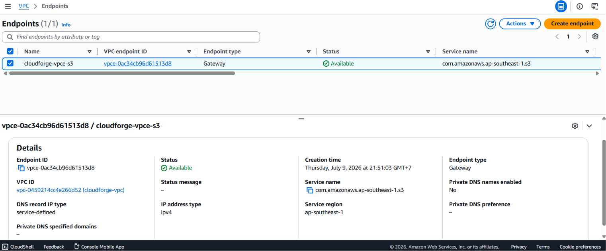

Trong các hệ thống xử lý Media / AI Pipeline, việc các Worker nằm trong Private Subnet phải liên tục đọc/ghi các file dung lượng lớn (như các file video, ảnh chất lượng cao) vào Amazon S3 là chuyện diễn ra từng giây. 

Nếu dữ liệu này đi theo đường định tuyến mặc định (Private Subnet $\rightarrow$ NAT Gateway $\rightarrow$ Internet $\rightarrow$ S3), AWS sẽ tính phí xử lý dữ liệu của NAT Gateway (khoảng $0.045/GB). Với hàng trăm GB hoặc hàng TB video chạy thực tế, chi phí sẽ tăng phi mã. Để giải quyết bài toán này, công cụ **VPC and more** đã tự động thiết lập một **S3 Gateway Endpoint**.

#### 1. Kiểm tra trạng thái Endpoint
1. Tại menu bên trái dịch vụ VPC, tìm đến mục **Endpoints** (nằm dưới danh mục *Virtual private cloud*).
2. Bạn sẽ thấy một Endpoint có tên chứa `cloudforge-vpce-s3`.
3. Đảm bảo cột **Status** đang báo chữ màu xanh: **Available**.
4. Hãy nhìn vào mục **Service name**, nó sẽ trỏ đến dịch vụ S3 của region Singapore: `com.amazonaws.ap-southeast-1.s3`.

   

#### 2. Bí mật nằm ở Bảng định tuyến (Route Table)
Làm thế nào để các máy chủ trong Private Subnet biết đường "đi tắt" đến S3 mà không chui qua NAT Gateway? Câu trả lời nằm ở các luật định tuyến được tự động chèn vào:

1. Quay trở lại mục **Route tables**, chọn một **Private Route Table** của hệ thống.
2. Bấm sang tab **Routes**, bạn sẽ thấy một dòng luật mới xuất hiện song song với luật của NAT Gateway:
   * **Destination:** `pl-XXXXXX` (Đây là một *Prefix List* – danh sách chứa toàn bộ dải IP công cộng của dịch vụ S3 thuộc AWS).
   * **Target:** Trỏ thẳng về `vpce-XXXXXX` (Chính là mã ID của cái S3 Gateway Endpoint ở trên).

   

#### 🎯 Kết luận kiến trúc:
Nhờ có luật định tuyến này, bất kể khi nào các ứng dụng AI Worker hay Backend của chúng ta gọi lệnh upload/download video tới S3, gói tin sẽ được AWS "bẻ lái" chạy trực tiếp qua đường cổng sau nội bộ của mạng AWS, **bỏ qua hoàn toàn NAT Gateway**. Thao tác này giúp đường truyền đạt tốc độ tối đa (vận tốc mạng nội bộ trung tâm dữ liệu) và **chi phí truyền tải dữ liệu bằng 0 USD**!

***

**Bước tiếp theo:** Sau khi hệ thống mạng, định tuyến, và đường tắt tối ưu chi phí đã hoàn thành hoàn hảo, chúng ta sẽ tiến tới phần **5.3.4: Cấu hình Security Groups** để thiết lập các lớp khóa tường lửa bảo vệ cho từng dịch vụ cụ thể.
