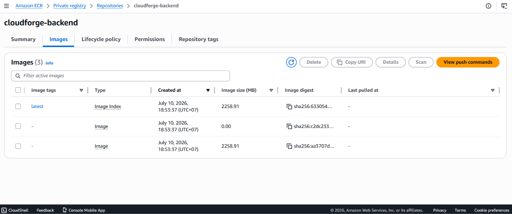
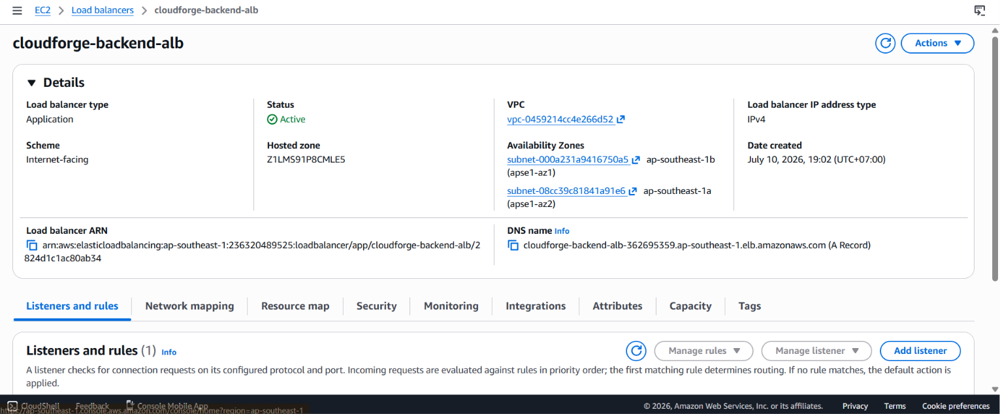
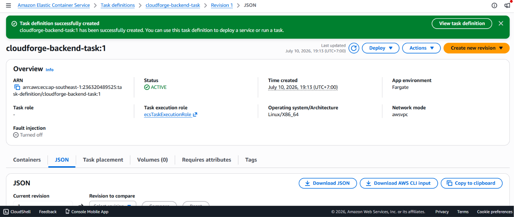
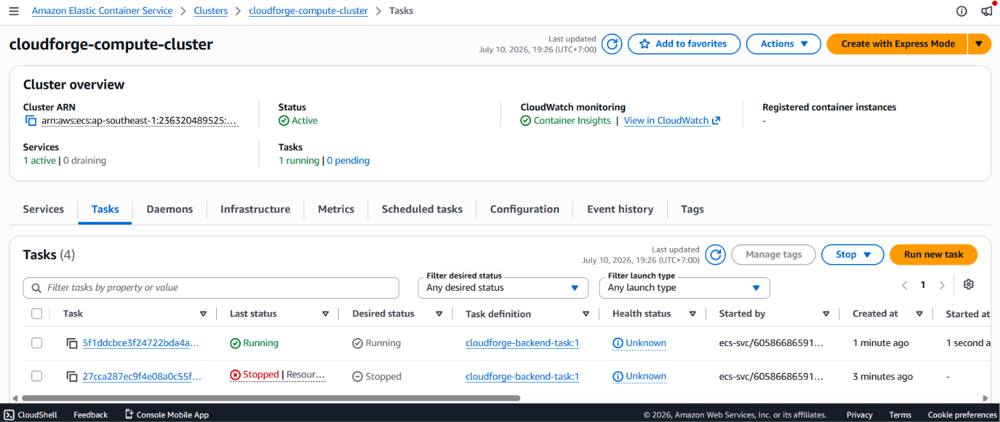

Tầng Backend API đóng vai trò là lõi điều hướng, chịu trách nhiệm tiếp nhận luồng yêu cầu HTTP/HTTPS từ người dùng, thực thi logic nghiệp vụ và tương tác với các phân lớp cơ sở dữ liệu, hàng đợi thông điệp. Trong phân đoạn này, chúng chúng ta sẽ thực hiện đóng gói mã nguồn Backend thành Docker Image, đẩy lên kho lưu trữ Amazon ECR, cấu hình bộ cân bằng tải Application Load Balancer (ALB) và triển khai ứng dụng trên nền tảng Serverless AWS Fargate.

#### 1. Đóng gói và đẩy mã nguồn lên Amazon ECR
Để chuyển giao mã nguồn cục bộ lên hạ tầng Cloud, chúng ta tiến hành biên dịch ứng dụng thành Docker Image và đẩy vào kho lưu trữ `cloudforge-backend` đã khởi tạo ở bài trước thông qua công cụ dòng lệnh (AWS CLI).

1. Mở Terminal tại thư mục gốc của toàn bộ dự án trên máy tính cục bộ.
2. Thực hiện đăng nhập và xác thực quyền truy cập vào Amazon ECR Private Registry của tài khoản:
   ```bash
   aws ecr get-login-password --region ap-southeast-1 | docker login --username AWS --password-stdin 236320489525.dkr.ecr.ap-southeast-1.amazonaws.com
   ```
3. Di chuyển vào đúng thư mục chứa mã nguồn Backend (nơi lưu trữ tệp Dockerfile):
   ```bash
   cd backend
   ```
4. Tiến hành biên dịch (Build) Docker Image và gắn trực tiếp thẻ định danh (Tag) ánh xạ về kho lưu trữ từ xa trên AWS:
   ```bash
   docker build -t 236320489525.dkr.ecr.ap-southeast-1.amazonaws.com/cloudforge-backend:latest .
   ```
5. Đẩy (Push) sản phẩm đã đóng gói lên đám mây:
   ```bash
   docker push 236320489525.dkr.ecr.ap-southeast-1.amazonaws.com/cloudforge-backend:latest
   ```

*Ảnh minh họa: Image của ứng dụng Backend đã được đẩy thành công lên Amazon ECR với tag latest.*


#### 2. Khởi tạo Application Load Balancer (ALB)
Do các Container của ứng dụng Backend sẽ được cô lập hoàn toàn bên trong vùng mạng Private Subnet nhằm bảo mật, chúng ta cần thiết lập một bộ cân bằng tải Application Load Balancer (ALB) nằm tại vùng mạng Public Subnets đóng vai trò làm lá chắn trung gian tiếp nhận và phân phối lưu lượng từ Internet.

**Bước 1: Khởi tạo Target Group**
1. Truy cập dịch vụ **EC2** → **Target Groups** → **Create target group**.
2. **Choose a target type:** Chọn **IP addresses** (Đây là bắt buộc đối với kiến trúc AWS Fargate vì mỗi Task sẽ sở hữu một địa chỉ IP nội bộ riêng biệt thuộc Elastic Network Interface - ENI).
3. **Target group name:** Nhập `cloudforge-backend-tg`.
4. **Protocol & Port:** Chọn HTTP và cấu hình cổng `8080`.
5. **VPC:** Chọn đúng `cloudforge-vpc`.
6. Phần **Health checks** giữ nguyên cấu hình mặc định và bấm **Next** → **Create target group** (Bỏ qua bước đăng ký IP thủ công vì ECS Service sẽ tự động quản lý luồng này).

**Bước 2: Cấu hình Load Balancer**
1. Tại menu trái EC2, chọn **Load Balancers** → Bấm **Create load balancer** → Chọn **Application Load Balancer**.
2. **Load balancer name:** Nhập `cloudforge-backend-alb`.
3. **Scheme:** Tích chọn **Internet-facing** để cho phép tiếp nhận traffic công cộng.
4. **Network mapping:**
   - Chọn VPC của dự án (`cloudforge-vpc`).
   - Tại mục Mappings, tích chọn cả 2 vùng Availability Zone (`ap-southeast-1a` và `ap-southeast-1b`), đồng thời ánh xạ chính xác vào các **Public Subnets** tương ứng của từng Zone.
5. **Security groups:** Chọn Security Group đã cấu hình từ trước cho phép mở cổng 80 (HTTP) và cổng 443 (HTTPS) từ mọi nguồn (`0.0.0.0/0`).
6. **Listeners and routing:** Tại giao thức HTTP Port 80, mục Default action chọn chuyển tiếp (Forward to) về Target Group `cloudforge-backend-tg` vừa tạo ở Bước 1.
7. Bấm **Create load balancer**.

*Ảnh minh họa: Bộ cân bằng tải Application Load Balancer (ALB) khởi tạo thành công ở trạng thái Active.*


#### 3. Thiết lập cấu hình tác vụ (Task Definition)
Task Definition đóng vai trò là một bản thiết kế kiến trúc (Blueprint) quy định chi tiết về giới hạn phần cứng, hình ảnh Docker sử dụng và các tham số bảo mật của ứng dụng.

1. Truy cập dịch vụ **Amazon ECS** → **Task definitions** → Bấm **Create new task definition**.
2. **Task definition configuration:** Định danh tên `cloudforge-backend-task`.
3. **Infrastructure requirements:**
   - **Launch type:** Chọn **AWS Fargate**.
   - **Task size:** Chỉ định tài nguyên tối ưu chi phí bao gồm `0.5 vCPU` và `1 GB` Memory.
   - **Task execution role:** Chọn tạo mới hoặc chỉ định `ecsTaskExecutionRole` (Cấp quyền cho tác vụ kéo ảnh từ ECR và đẩy logs về CloudWatch).
4. **Container configuration:**
   - **Container name:** `backend-container`.
   - **Image URI:** Dán chuỗi liên kết ECR chính xác: `236320489525.dkr.ecr.ap-southeast-1.amazonaws.com/cloudforge-backend:latest`.
   - **Port mappings:** Cấu hình Cổng Container là `8080`, Giao thức `TCP`, App protocol chọn `HTTP`.
5. **Environment variables (Best Practice Bảo mật):**
   - Thay vì mã hóa cứng thông tin kết nối CSDL, tại mục các biến môi trường, tiến hành ánh xạ các biến `DB_HOST`, `DB_PASSWORD` lấy trực tiếp giá trị an toàn từ dịch vụ AWS Secrets Manager bằng cơ chế `ValueFrom`.
6. Bấm **Create**.

*Ảnh minh họa: Khởi tạo Task Definition hoàn tất với đầy đủ thông số cấu hình phần cứng và Image URI.*


#### 4. Triển khai vận hành ECS Service
Service đóng vai trò giữ điều phối, đảm bảo duy trì liên tục số lượng Container hoạt động ổn định và tự động kết nối chúng với bộ cân bằng tải ALB.

1. Tại bảng điều khiển **Amazon ECS**, chọn Cluster `cloudforge-compute-cluster`.
2. Chuyển sang tab **Services** → Bấm **Create**.
3. **Environment:** Chọn tính năng Launch type và chỉ định **FARGATE**.
4. **Deployment configuration:**
   - **Application type:** Chọn **Service**.
   - **Task definition:** Chọn Family `cloudforge-backend-task` với phiên bản mới nhất (`latest`).
   - **Service name:** Nhập tên định danh `cloudforge-backend-service`.
   - **Desired tasks:** Nhập giá trị là `2` (Cấu hình chạy song song 2 containers đồng thời trên 2 AZs khác nhau nhằm đảm bảo tính sẵn sàng cao - High Availability cho hệ thống API).
5. **Networking:**
   - **VPC:** Chọn `cloudforge-vpc`.
   - **Subnets:** Chỉ định chính xác 2 vùng mạng biệt lập **Private Subnets**. (Tuyệt đối không chọn Public Subnet để tuân thủ quy chuẩn an toàn Zero-Trust).
   - **Security group:** Chọn SG cho phép tiếp nhận lưu lượng Inbound duy nhất từ Security Group của ALB chạy qua cổng `8080`.
6. **Load balancing:**
   - **Load balancer type:** Chọn **Application Load Balancer**.
   - **Load balancer:** Chọn `cloudforge-backend-alb`.
   - **Container to load balance:** Hệ thống tự động nhận diện `backend-container:8080:8080`. Bấm **Add to load balancer**.
   - **Target group:** Chọn `cloudforge-backend-tg` đã thiết lập sẵn.
7. Cuộn xuống cuối và bấm **Create**.

*Ảnh minh họa: Tầng Backend API triển khai thành công với trạng thái các Tasks đạt trạng thái RUNNING xanh lè.*


{}
**Architectural Note (Isolate by Design):** Với mô hình thiết kế phân tách này, hệ thống Backend API sở hữu hai lớp bảo vệ nghiêm ngặt. Toàn bộ lưu lượng tấn công tiềm ẩn từ Internet sẽ bị chặn lại hoặc lọc bớt tại bộ cân bằng tải ALB thuộc vùng Public Subnet (Có thể bọc thêm AWS WAF). Luồng dữ liệu sạch sau đó mới được định tuyến âm thầm qua mạng nội bộ để đi vào các Container nằm sâu trong vùng mạng Private Subnet, triệt tiêu hoàn toàn rủi ro bị khai thác lỗ hổng trực diện từ môi trường bên ngoài.
{}

***

**Bước tiếp theo:** Hệ thống Backend API đã được triển khai hoàn tất và có thể tiếp nhận yêu cầu điều phối thông qua endpoint của ALB. Chúng ta sẽ tiếp tục thiết lập thành phần "não bộ" phân tích của dự án tại bài **5.7.3: Triển khai ECS AI Worker** để cấu hình cụm máy chủ chuyên trách xử lý các tác vụ xử lý ngầm từ hàng đợi SQS.
