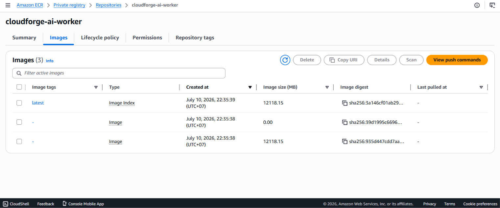
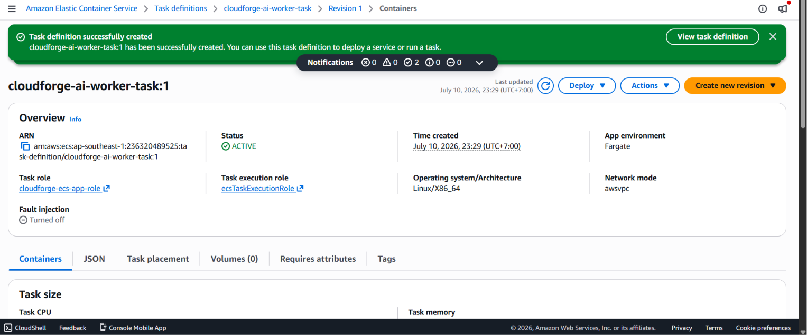

In contrast to the Backend API system, which is responsible for receiving and responding to direct request streams from end-users, the **AI Worker** system acts as the background processor of the entire project. This system operates completely isolated, without opening any ports to the Internet. Instead, it continuously polls for event messages from the Amazon SQS queue, thereby triggering Media analysis cycles and interacting with artificial intelligence models.

In this segment, we will package the AI Worker source code, push it to the Amazon ECR Private repository, and deploy it as an isolated **Background Service** on the AWS Fargate serverless infrastructure.

#### 1. Package and push source code to Amazon ECR
This packaging and compilation process is executed directly at the AI Worker's dedicated source code directory and mapped to the created `cloudforge-ai-worker` repository.

1. Open the integrated Terminal in the IDE at the root directory of the project.
2. Log in and authenticate to Amazon ECR (If the previous AWS CLI session has expired):
   ```bash
   aws ecr get-login-password --region ap-southeast-1 | docker login --username AWS --password-stdin 236320489525.dkr.ecr.ap-southeast-1.amazonaws.com
   ```
3. Navigate to the directory containing the AI Worker's source code:
   ```bash
   cd ai-worker
   ```
4. Compile the Docker Image based on the dedicated Dockerfile configuration and assign the specified tag:
   ```bash
   docker build -t 236320489525.dkr.ecr.ap-southeast-1.amazonaws.com/cloudforge-ai-worker:latest .
   ```
5. Push the completed Image to the ECR cloud:
   ```bash
   docker push 236320489525.dkr.ecr.ap-southeast-1.amazonaws.com/cloudforge-ai-worker:latest
   ```

*Illustration: The AI Worker's Docker Image file has been successfully pushed to the Amazon ECR Private Registry.*


#### 2. Establish Task Definition
Due to the specific requirement of executing computational tasks related to Media data stream processing and running machine learning model algorithms, the AI Worker's virtual hardware configuration will be set higher than the standard API tier.

1. Access the **Amazon ECS** service → **Task definitions** → Click **Create new task definition**.
2. **Task definition configuration:** Set the identifier name `cloudforge-ai-worker-task`.
3. **Infrastructure requirements:**
   - **Launch type:** Select **AWS Fargate**.
   - **Task size:** Allocate optimal processing resources including `1 vCPU` for the processor and `2 GB` for RAM capacity.
   - **Task execution role:** Specify the `ecsTaskExecutionRole` role, which possesses attached policies for Secrets Manager access to load system environment variables.
   - **Task role (Crucial):** Click to select the dedicated IAM Role for background applications (e.g., `cloudforge-ecs-app-role`) that has been pre-granted core security permissions including: Read/delete message permissions from Amazon SQS (`sqs:ReceiveMessage`, `sqs:DeleteMessage`), read/write permissions for digital resources from Amazon S3, and database state update permissions.
4. **Container configuration:**
   - **Container name:** Define the name `worker-container`.
   - **Image URI:** Paste the exact link from ECR: `236320489525.dkr.ecr.ap-southeast-1.amazonaws.com/cloudforge-ai-worker:latest`.
   - **Port mappings:** LEAVE COMPLETELY BLANK. Because the Worker operates specifically on an Outbound model (Actively calling out of the system to fetch jobs), not opening an Inbound port helps completely eliminate the network Attack Surface.
5. **Environment variables:**
   - Proceed to load dynamic links including the SQS queue path `SQS_QUEUE_URL` and the S3 storage resource name `S3_BUCKET_NAME` so the application source code can automatically identify the destinations.
6. Click **Create** to save the V1 configuration.

*Illustration: Task Definition configuration completed with Port Mappings removed to maximize information security.*


#### 3. Deploy ECS Service Operations (Background Worker)
Because the AI Worker does not use a Load Balancer to receive Traffic, the Service configuration initialization cycle on the network will be streamlined as much as possible, focusing on infrastructure isolation.

1. Return to the **Amazon ECS** dashboard, access the `cloudforge-compute-cluster` data Cluster.
2. In the **Services** module, click the **Create** action.
3. **Environment:** Ensure the infrastructure option is Launch type combined with **FARGATE**.
4. **Deployment configuration:**
   - **Application type:** Select **Service**.
   - **Task definition:** Select the `cloudforge-ai-worker-task` Family task just established with the newest version (`latest`).
   - **Service name:** Enter the identifier service name `cloudforge-ai-worker-service`.
   - **Desired tasks:** Set the initial default launch configuration to `1` (The system can automatically scale - Auto Scaling based on the number of backlogged messages in the SQS queue during peak operational periods).
5. **Networking (Core Network Setup):**
   - **VPC:** Select the correct internal network `cloudforge-vpc`.
   - **Subnets:** Accurately check the system of closed **Private Subnets** zones.
   - **Security group:** Click to select the centralized security group `cloudforge-ecs-app-sg` (This group blocks all incoming data from the outside but allows free Outbound calls to the Internet via the NAT Gateway network to connect to SQS and S3).
   - **Public IP:** Switch the mandatory state to **Turned off**.
6. **Load balancing:** In this module, select the **None** state (Do not apply a load balancer).
7. Scroll to the bottom of the dashboard and click the orange **Create** button.

*Illustration: The AI Worker application successfully launched, automatically connecting to the network queue with a stable RUNNING state.*


{}
**Architectural Note (Decoupled Architecture):** This design model reflects the characteristics of Event-Driven Architecture with its Loosely Coupled nature. The Ingestion receiving system (S3/EventBridge) and the computational processing system (AI Worker) do not have a direct connection in terms of network infrastructure. Amazon SQS acts as an intermediary Buffer. If the system receives thousands of uploaded multimedia files at the same time, SQS will safely store them in the queue for the AI Worker to fetch and process sequentially, eliminating the risk of network congestion or system crashes due to resource overload.
{}

***

**Next Step:** The entire core processing infrastructure system including Network connectivity, Storage database, Asynchronous event orchestration, and Compute cluster (ECS Backend & Worker) of the Smart Media Analytics project has been completely built and linked. We will move on to the next chapter to execute **Frontend Deployment** and configure an intuitive interactive interface for the end-user.
